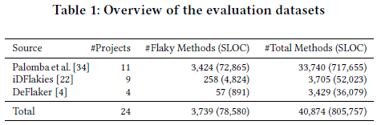
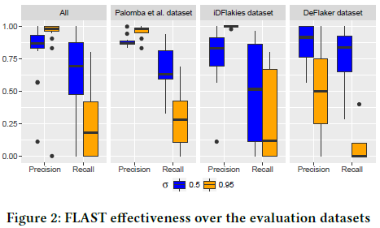
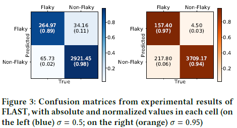
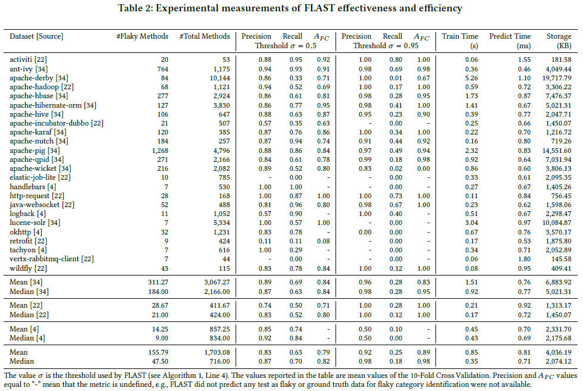
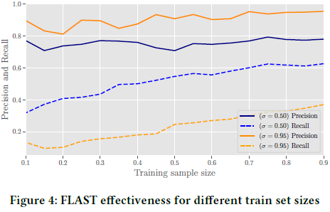
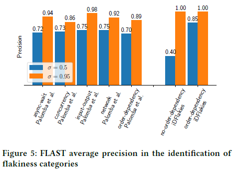
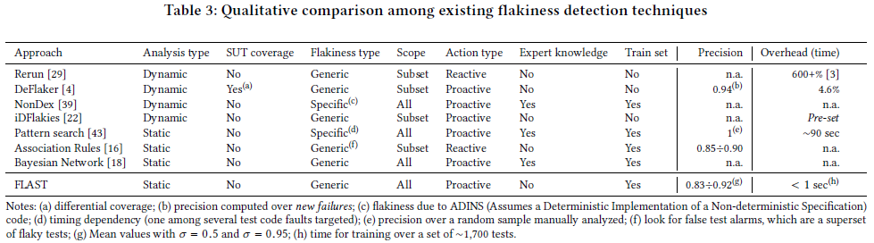

Evaluation Results
----------------

### Evaluation Datasets

---
### [RQ1] How effective is FLAST in predicting test flakiness?

---
### [RQ2] How does FLAST effectiveness vary with the size of the train sample?

---
### [RQ3] How effective is FLAST in identifying a flaky test category?

---
### [RQ5] How does FLAST compare with other state-of-the-art techniques?

